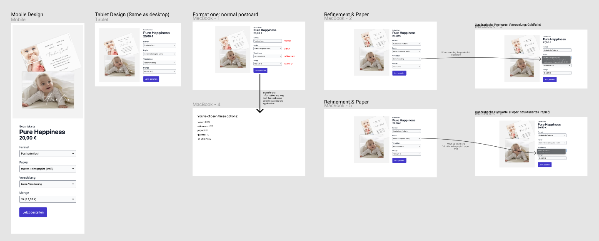
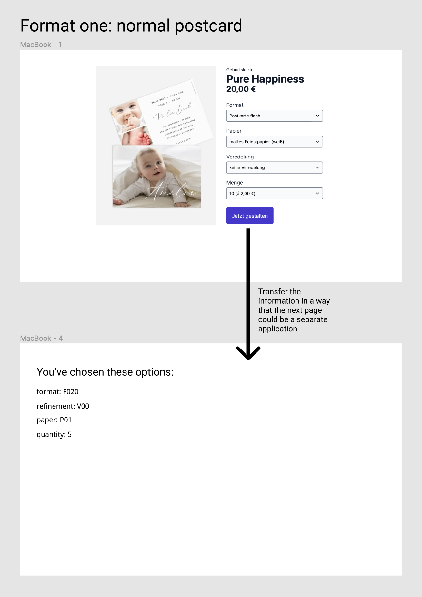

# Product-detail-dage with interconnected select-fields

### running on Next JS 12+, REST API, TypeScript, with URL-Parameters via React Router Query including param-value-verification

'

###### Demo on Vercel: https://willFollowLater.vercel.app/products/

[](https://willFollowLater.vercel.app/products/)

🚀 Next.js, TypeScript, ⚡️ ESLint, Forwarding Refs, browser api curreny formatter, Internationalization API Intl.NumberFormat, cypress & jest, VSCode, Prettier, Vercel.

URL-Parameters with value-verification for React Router Query-Values.

REST API is requested serverside via ISG ( [Incremental Site Generation](https://www.smashingmagazine.com/2021/04/incremental-static-regeneration-nextjs/) ) to create and deliver Static Pages for all ProductDetail-Pages

Data gets revalidated in hindsight on the server (once every 24 hours).

### Features

- 🔥 [Next.js](https://nextjs.org) for Incremental Site Generation ( Static Site Generator )
- 🎨 component based CSS
- 🎉 Type checking [TypeScript](https://www.typescriptlang.org)
- ✅ Strict Mode for TypeScript and React 17
- ✏️ Linter with [ESLint](https://eslint.org) (default NextJS, NextJS Core Web Vitals and Airbnb configuration)
- 🛠 Code Formatter with [Prettier](https://prettier.io)

Built-in feature from Next.js:

- ☕ Minify HTML & CSS
- 💨 Live reload
- ✅ Cache busting

### Philosophy

- Minimal code
- SEO-friendly
- 🚀 Production-ready

### Requirements

- Node.js and npm

### Getting started

Run the following command on your local environment:

```
git clone --depth=1 https://github.com/stefanibus/stefanoToBeUpdated.git my-project-name
cd my-project-name
npm install
```

Open [http://localhost:3000/pdp/MGG73GG](http://localhost:3000/pdp/MGG73GG) with your favorite browser to see your project.

You can start editing the page by modifying `pages/pdp/[id].tsx`.

The page will auto-update as you edit the file.

Then, you can run locally in development mode with live reload:

```
npm run dev
```

```

📦components
 ┣ 📂button
 ┃ ┣ 📜index.module.css
 ┃ ┗ 📜index.tsx
 ┣ 📂pdp
 ┃ ┣ 📂images
 ┃ ┃ ┣ 📜index.module.css
 ┃ ┃ ┗ 📜index.tsx
 ┃ ┣ 📂Price
 ┃ ┃ ┣ 📜index.module.css
 ┃ ┃ ┗ 📜index.tsx
 ┃ ┣ 📂Select
 ┃ ┃ ┣ 📜createDropdown.tsx
 ┃ ┃ ┗ 📜index.tsx
 ┃ ┗ 📂SelectField
 ┃ ┃ ┣ 📜index.module.css
 ┃ ┃ ┗ 📜index.tsx
 ┗ 📂Stack
 ┃ ┣ 📜index.module.css
 ┃ ┗ 📜index.tsx
📦pages
 ┣ 📂configure
 ┃ ┣ 📜index.module.css
 ┃ ┗ 📜index.tsx
 ┣ 📂pdp
 ┃ ┣ 📜index.module.css
 ┃ ┗ 📜[id].tsx
 ┣ 📜index.tsx
 ┗ 📜_app.tsx
 📦styles
 ┣ 📜globals.css
 ┗ 📜Home.module.css
 📦utils
 ┣ 📜config.tsx
 ┗ 📜currencyFormatter.tsx

```

### Deploy to production

You can see the results locally in production mode with:

```
$ npm run build
$ npm run start
```

The generated HTML and CSS files are minified (built-in feature from Next js). It will also remove unused CSS.

You can create an optimized production build with:

```
npm run build-prod
```

Now, your page is ready to be deployed. All generated files are located at `out` folder, which you can deploy with any hosting service.

# Definition of the Challenge

## Task-Definition: 'Product-Detail page'

Welcome to the frontend coding challenge 🤗.

The goal of this coding challenge is twofold. On the one hand, it gives you the chance to demonstrate your coding skills. On the other hand, it will give you a sense for what working at Celebrate will be like. In the end, it should help you and us in making the right decision.

## The task: Modernizing our product detail page 💫

Your mission for this coding challenge is to modernize our product detail page (PDP).

Modernizing here basically means **rewriting**, while **maintaining the existing business logic**.

In order to keep the scope small enough, the focus of this challenge is **only the product detail page**. The backend part is already done and is not subject of this coding challenge. We've created a mock API in the `server` folder that the frontend should consume to build the PDP. We did simplify the actual data structure a bit, but not fully just to keep this challenge somewhat real and true to what would expect you when you work at celebrate.

### Business logic

The mock API only has one product: A birth card.

This birth card comes in two different variants: a normal post card and a square post card. The variant is identified by the **format**. The customer should be able to choose between these two variants on the PDP.

For each variant there is a set of available **product options**:

- **Refinement**: Can be chosen optionally to make the name of the baby be printed using a golden foil
- **Paper**: The card comes in three different paper types: matte paper, structured paper, silk matte paper. The available paper types depend on the whether a refinement is selected and should update accordingly.
- **Quantity**: Defines in which quantities the customer can by the product. It also defines, how much the customer has to pay per item depending on the number of items. The price usually gets lower the more items the customer buys (tiered pricing).

The price, which is displayed below the product name on the PDP, depends on the selected product options. It should update when the customer changes any product option.

The product image should only update with the selected format variant, not for any of the other options (unlike on our live page).

To see the existing business logic in action you can take a look at the full product how it is live today: https://www.kartenmacherei.de/geburtskarte-pure-happiness.html. Note that the real birth card product has a more product options than the one that is returned by the API of this coding challenge in order to keep the scope small enough.

Also, to keep the scope small, this coding challenge focuses solely on the product image, the product options, and the "configure product"-button — nothing else on the PDP is relevant. To visualize that see the following Figma link: https://www.figma.com/file/2ycT86CtXp23ITMcuTadwO/Frontend-Coding-Challenge?node-id=0%3A1.

The "configure product" ("jetzt gestalten") button should navigate to a page that lists all the selected product options. We'll call it the configurator page. On our actual live shop, this configurator page is a separate application with a different codebase and a different tech stack. Please transfer the information about the selected product options so that the configurator page can be a separate application like on our live shop. (Hint: the selected product options should still be available on page refresh.)



So just to sum up the **requirements**:

- PDP that shows the single product that's returned by the API in the `server` folder
- PDP contains one product image, information about the product name, price, product options and a "configure product" button
- The "configure product" button redirects to a blank page that lists the selected product options

## Technical setup 💻

We've already went ahead and setup the code base for you. This is the tech stack:

- React
- Next.js
- Typescript
- CSS Modules

Additionally, we've already setup some code to help you get going:

- There are already two routes `products`, for the PDP, and `configure`, for the page that gets shown when clicking the "configure product" button
  - The `configure` page expects the selected product variant information to be passed as query parameters via the URL and already prints them out
- The product data is already loaded from the backend and passed to the `ProductDetails` component

The things we build at celebrate usually have quite a long lifetime, so it's important to ensure our code is properly tested and quality is assured. We already went ahead and wrote the tests so (1) you don't have to and (2) you can use them to validate if your implementation is working.

## What we evaluate 🧑‍🏫

- Feature completion & correctness of business logic
- Clean & understandable code
- Quality of CSS
- Performance
- Responsiveness
- Accessibility

## What's explicitly not part of the challenge 🙅‍♂️

- CI/CD
- Backend implementation
- Error tracking
- Analytics
- i18n
- Fancy Designs: Please don't spend too much time on developing some fancy UI to avoid not having enough time for implementing the business logic correctly.

Even if these things are not part of the challenge, we'll probably have a chat about them in the next interview 😊.

## Questions? 💬

In case there is anything unclear about what this challenge is about, what the scope is, what our expectations are, feel free to reach out to us! Although we did the challenge ourselves,there is still a chance that we missed something 😅.

---

Made with ♥ by [make-mobile.de](https://make-mobile.de)
